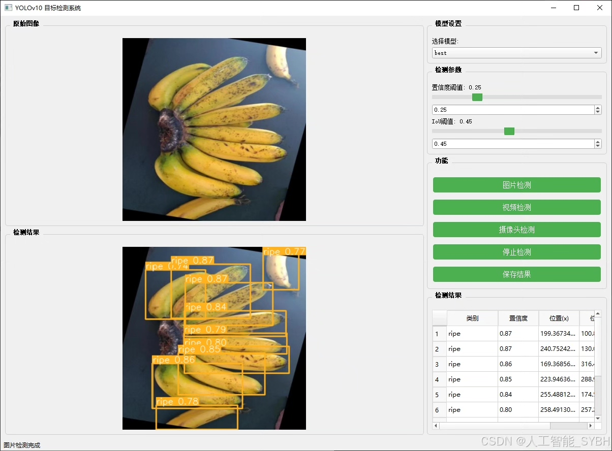
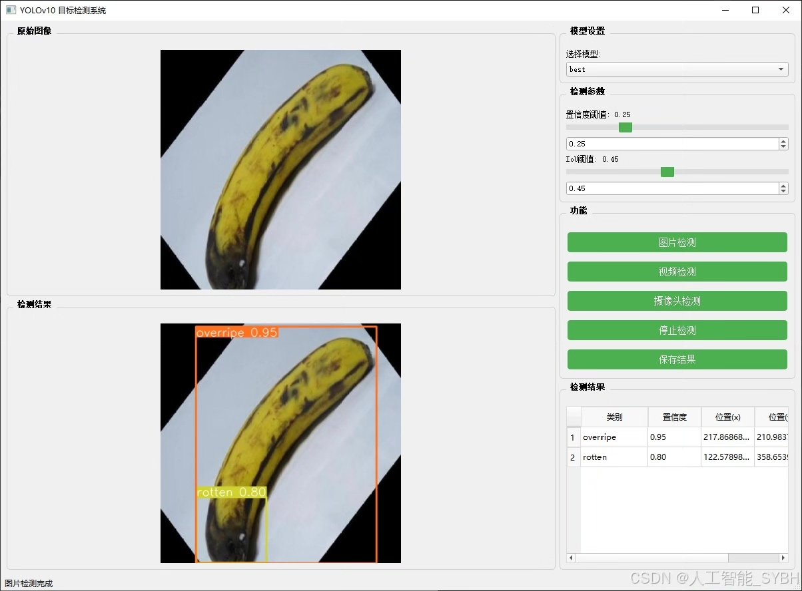
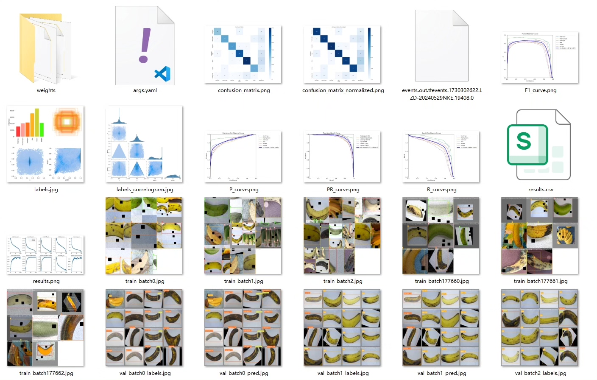
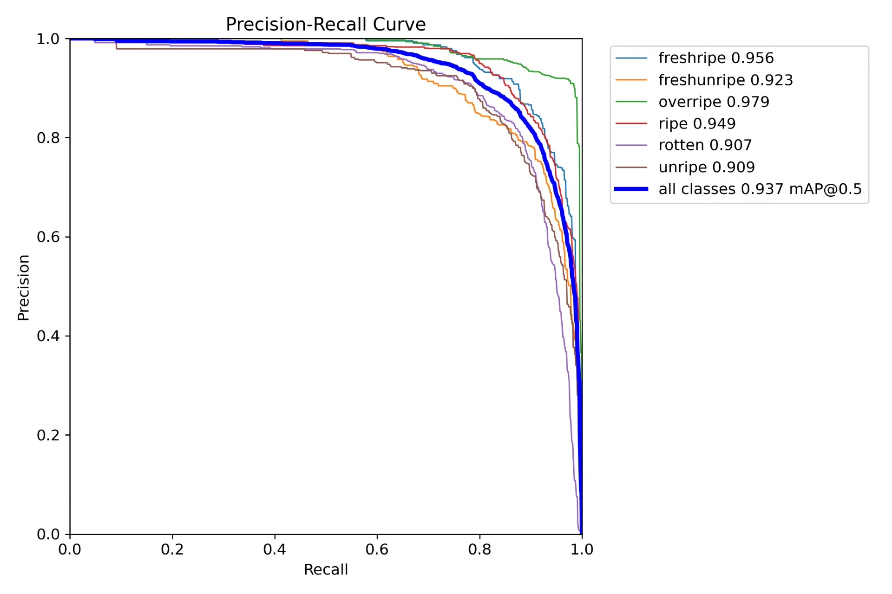
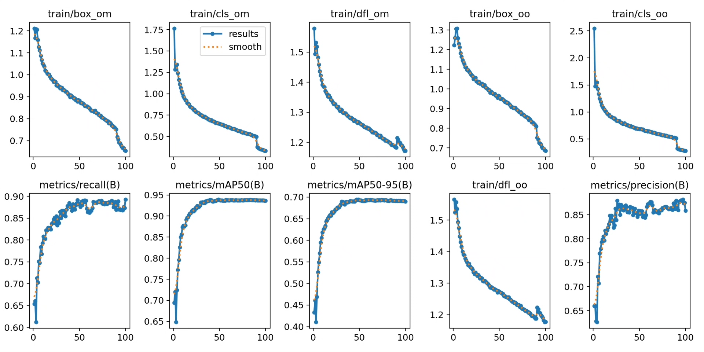
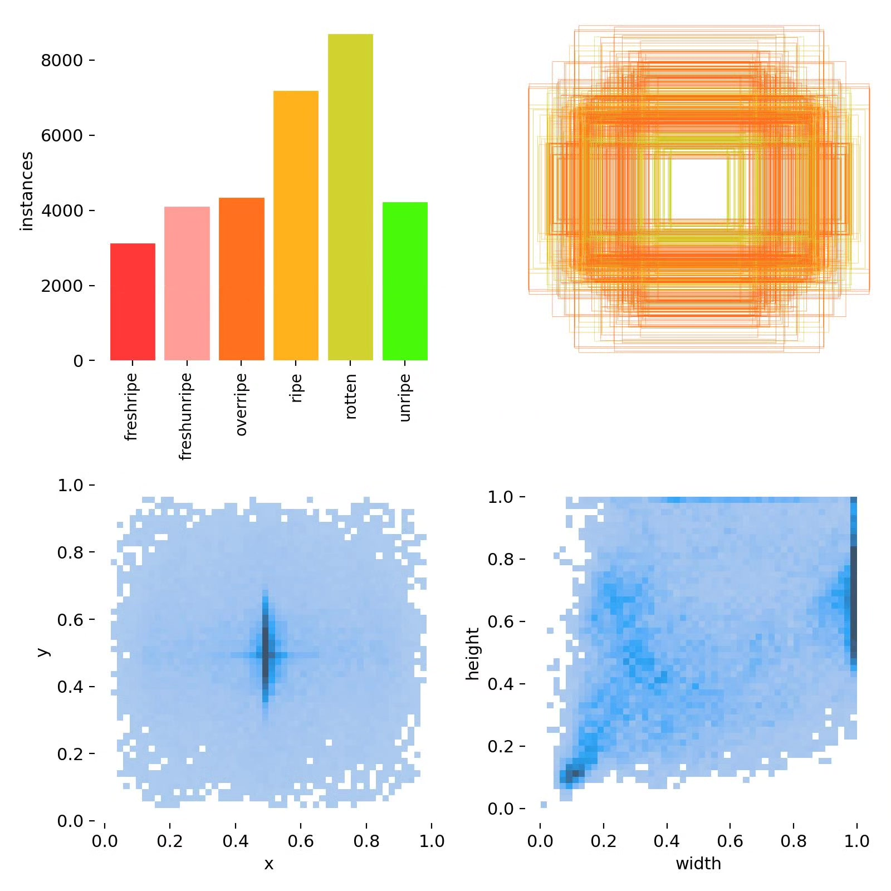
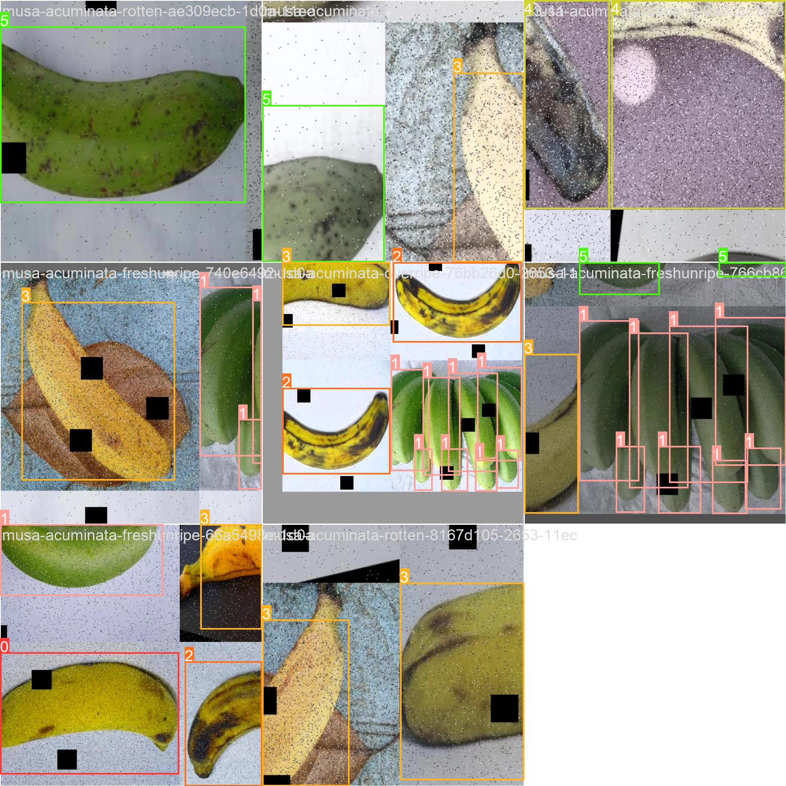
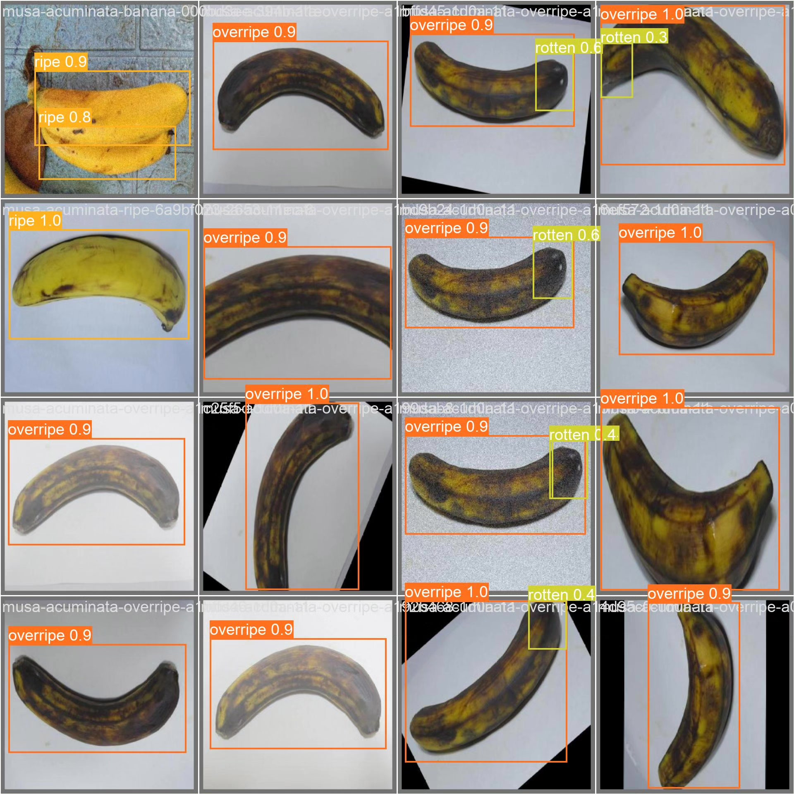

# Banana ripeness detection system based on YOLOv10 deep learning

## Body

This article introduces a banana ripeness detection system based on YOLOv10, aiming to automatically identify and classify the ripeness of bananas through computer vision technology. The system can accurately distinguish six different ripeness categories: fresh ripe (freshripe), fresh unripe (freshunripe), overripe (overripe), ripe (ripe), rotten (rotten), and unripe (unripe). By using the YOLOv10 model, we have achieved efficient real-time detection, and the dataset contains 18,074 images for training, validation, and testing. Experimental results show that the system performs excellently in the task of banana ripeness detection, with high accuracy and robustness.

The company's products have obtained the official commercial license certification from YOLO.

Package after-sales service: After payment, we will provide WeChat IDs for instant questions and answers.

Environment configuration: A tutorial on environment configuration will be provided, and WeChat will provide答疑.

Remote installation service: If you need remote configuration, an additional fee of 69 is required, with all fees refunded if the configuration fails (only the installation fee is refunded for older computers).

Retraining dataset: Once the environment is configured, you can train on your own computer. If you need us to retrain, just pay 69 plus computing power fees (2.5 yuan/hour).

Full after-sales service

## Images

## Payment

Here is a pay link on Stripe ( https://buy.stripe.com/3cs8yP7sY87d0vu9AB ). Please contact me lonlonago@foxmail.com after funding $89, and I will send you a complete data files , thank you!

